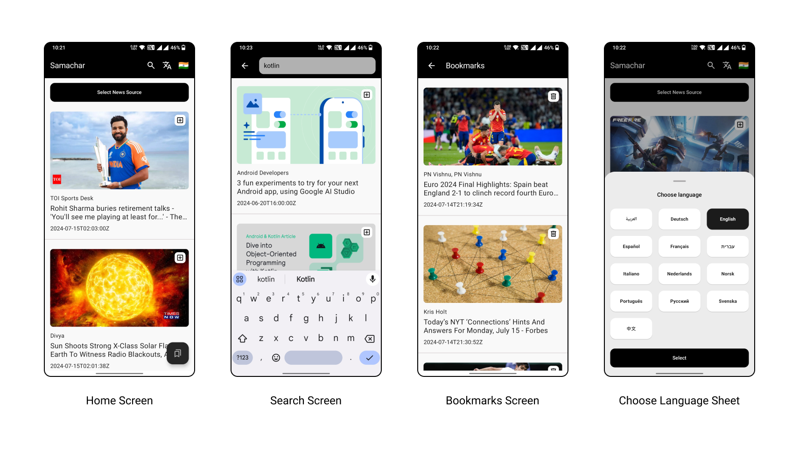
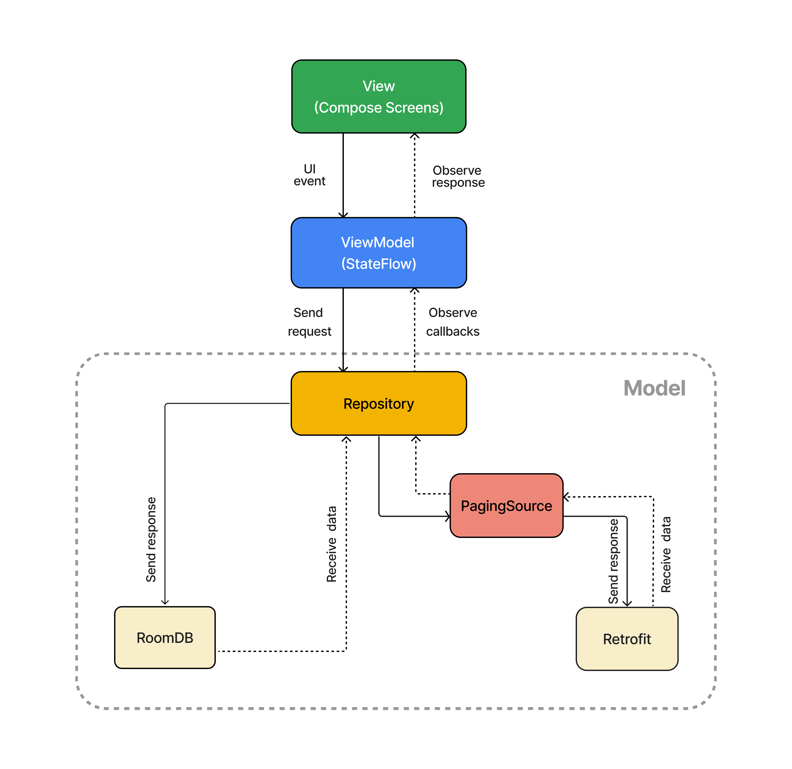

<h1 align="center">Samachar</h1>

<p align="center">  
🎨 Samachar is an Android news app built to demonstrate the MVVM architecture in Kotlin. It utilizes Jetpack Compose, Dagger Hilt, Retrofit, RoomDB, Coroutines, and Flow. ✨
</p>

## App UI
<p float="left">
   
</p>

## Major highlights

- **Instant Search**: Implemented using Kotlin Flow with debounce, distinctUntilChanged, and filter operators.
- **Headlines Filter**: Filter news headlines by country, language, and source.
- **Offline Mode**: Access news content even when offline.
- **Bookmark Headlines**: Save and access your favorite news articles for later.
- **Dependency Injection**: Manage dependencies cleanly and efficiently using Hilt.
- **Paginated Data Loading**: Efficiently load news articles with pagination support.
- **API Key Management**: API key handled securely as a header in the interceptor.
- **Unit Tests**: Unit tests for critical components.

## Download
Check out [Releases](https://github.com/ArjunJadeja/Samachar/releases) to download the latest APK (1.51 MB).

## API Key Setup

This project uses the NewsAPI to fetch news articles. Some users have encountered the `429 Too Many Requests` error due to API rate limits. To avoid this issue, it's recommended that each developer uses their own API key.

### Steps to Configure Your API Key

1. **Obtain an API Key**:
    - Visit the [NewsAPI](https://newsapi.org/) website.
    - Sign up and get your free API key.

2. **Link the API Key in the Code**:
    - Replace the current API Key with your own key in the `build.gradle` file.

3. **Rebuild the Project**:
    - Sync your project with Gradle files and rebuild the project to apply the changes.

By following these steps and using your own API key, you can avoid hitting the API rate limits and ensure smooth functioning of the app.

## Tech stack & Open-source libraries
- **Minimum SDK level 26**
- [**Kotlin**](https://kotlinlang.org/) - Modern, concise, and safe programming language.
- [**Dagger Hilt**](https://developer.android.com/training/dependency-injection/hilt-android) - Dagger Hilt is a dependency injection library for Android that reduces the boilerplate of doing manual dependency injection in your project.
- [**Kotlin Serialization**](https://github.com/Kotlin/kotlinx.serialization) - A compiler plugin that automatically produces visitor code for classes, and a runtime library that uses generated code to serialize objects without reflection.
- [**Coroutines**](https://kotlinlang.org/docs/coroutines-overview.html) - Asynchronous or non-blocking programming is an important part of the development landscape. Coroutines is our recommended solution for asynchronous programming on Android.
- [**Flow**](https://kotlinlang.org/api/kotlinx.coroutines/kotlinx-coroutines-core/kotlinx.coroutines.flow/-flow/) - An asynchronous data stream that sequentially emits values and completes normally or with an exception.
- [**Retrofit**](https://square.github.io/retrofit/) - A type-safe HTTP client for Android and Java.
- [**RoomDB**](https://developer.android.com/training/data-storage/room) - The Room persistence library provides an abstraction layer over SQLite to allow fluent database access while harnessing the full power of SQLite.
- [**Jetpack Compose**](https://developer.android.com/develop/ui/compose) - Jetpack Compose is Android’s recommended modern toolkit for building native UI. It simplifies and accelerates UI development on Android.
- [**Coil**](https://coil-kt.github.io/coil/) - An image loading library for Android backed by Kotlin Coroutines.
- [**Material 3**](https://github.com/material-components/material-components-android) - Material design components for building View layouts and Animations.

## App Architecture
MVVM architecture and the Repository pattern.
<p float="left">
   
</p>

## Package Structure

    com.arjun.samachar    # Root Package
    .
    ├── data                        # Data handling layer
    │   ├── local                   # Local database with Room
    │   │   ├── dao                 # Data Access Objects
    │   │   └── entity              # Database entities
    │   ├── remote                  # Remote data source
    │   │   ├── api                 # API endpoints
    │   │   ├── model               # Models for network responses
    │   │   └── AuthInterceptor.kt  # Network interceptor
    │   ├── model                   # Model classes
    │   ├── paging                  # Paging components
    │   └── repository              # Repository pattern implementation
    |
    ├── di                          # Dependency Injection
    │   ├── module                  # Dagger/Hilt modules
    │   └── Qualifiers.kt           # Qualifiers for DI
    |
    ├── ui                          # User Interface layer
    │   ├── base                    # Base components
    │   ├── headlines               # Headlines feature
    │   │   ├── home                # Home screen components
    │   │   ├── bookmark            # Bookmark screen components
    │   │   └── search              # Search screen components
    │   ├── filters                 # Filter components (country, language, source)
    │   ├── theme                   # Theming and styles
    │   ├── MainActivity.kt         # Main Activity
    │   └── MainViewModel.kt        # Main ViewModel
    |
    ├── utils                       # Utility classes and extensions
    └── App.kt                      # Application class

## Credits
- API from [NewsAPI](https://newsapi.org)
- Icons from [Flaticon](https://www.flaticon.com)
- Illustrations from [Iconsout](https://iconscout.com)

## Contribute
If you want to contribute to this library, you're always welcome!
See [Contributing Guidelines](CONTRIBUTING.md).

## Contact
Feel free to connect with me on [LinkedIn](https://www.linkedin.com/in/arjun-jadeja/)

## License
```xml
MIT License

Copyright (c) 2024 Arjun Jadeja

Permission is hereby granted, free of charge, to any person obtaining a copy
of this software and associated documentation files (the "Software"), to deal
in the Software without restriction, including without limitation the rights
to use, copy, modify, merge, publish, distribute, sublicense, and/or sell
copies of the Software, and to permit persons to whom the Software is
furnished to do so, subject to the following conditions:

The above copyright notice and this permission notice shall be included in all
copies or substantial portions of the Software.

THE SOFTWARE IS PROVIDED "AS IS", WITHOUT WARRANTY OF ANY KIND, EXPRESS OR
IMPLIED, INCLUDING BUT NOT LIMITED TO THE WARRANTIES OF MERCHANTABILITY,
FITNESS FOR A PARTICULAR PURPOSE AND NONINFRINGEMENT. IN NO EVENT SHALL THE
AUTHORS OR COPYRIGHT HOLDERS BE LIABLE FOR ANY CLAIM, DAMAGES OR OTHER
LIABILITY, WHETHER IN AN ACTION OF CONTRACT, TORT OR OTHERWISE, ARISING FROM,
OUT OF OR IN CONNECTION WITH THE SOFTWARE OR THE USE OR OTHER DEALINGS IN THE
SOFTWARE.
```